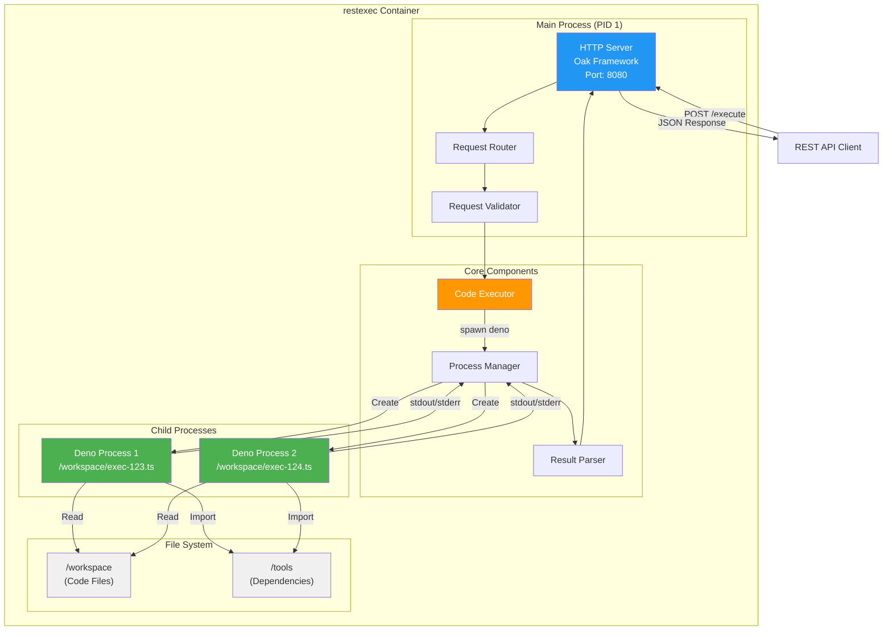

# restexec

`restexec` は、REST API経由でTypeScriptコードを安全に実行するサービスです。共有ディレクトリに配置されたTypeScriptファイルをDeno runtimeで動的に実行し、その結果をJSON形式で返却します。Denoの厳格なパーミッションシステムにより、ファイルシステム、ネットワーク、プロセス実行を細かく制御できます。

## システムアーキテクチャ



## ディレクトリ構造

```
restexec/
├── src/                       # ソースコード
│   ├── app.ts                 # Oak アプリケーション設定
│   ├── index.ts               # エントリーポイント
│   ├── config.ts              # 設定管理
│   ├── executor.ts            # コード実行エンジン
│   ├── middleware/
│   │   └── validation.ts      # リクエストバリデーション
│   ├── routes/
│   │   ├── execute.ts         # 実行エンドポイント
│   │   └── health.ts          # ヘルスチェックエンドポイント
│   ├── types/
│   │   └── index.ts           # 型定義
│   └── utils/
│       ├── logger.ts          # ロガー
│       └── errors.ts          # カスタムエラークラス
├── tests/                     # テストスイート
│   ├── unit/
│   │   └── executor.test.ts   # Executor ユニットテスト
│   └── fixtures/
│       ├── success.ts         # テスト用の成功コード
│       ├── error.ts           # テスト用のエラーコード
│       └── timeout.ts         # テスト用のタイムアウトコード
├── example/                   # サンプルコードとユーティリティ
│   ├── workspace/             # 実行可能スクリプト
│   │   ├── hello-world.ts
│   │   ├── with-import.ts
│   │   └── async-example.ts
│   └── tools/                 # 共有ユーティリティライブラリ
│       ├── math.ts
│       └── string.ts
├── specs/                     # 仕様書
│   ├── API.md
│   ├── SystemArchitecture.md
│   ├── Security.md
│   └── ...
├── Dockerfile                 # Docker イメージ定義
├── compose.yaml               # Docker Compose 設定
├── deno.json                  # Deno 設定
├── CLAUDE.md                  # AI アシスタント向けガイド
├── DOCKER.md                  # Docker ドキュメント
└── README.md
```
