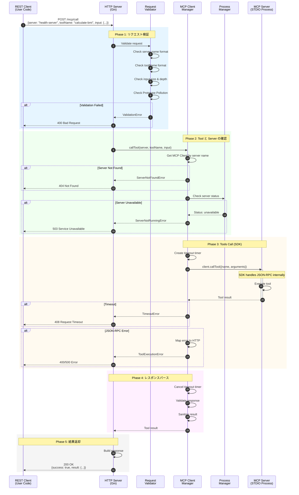
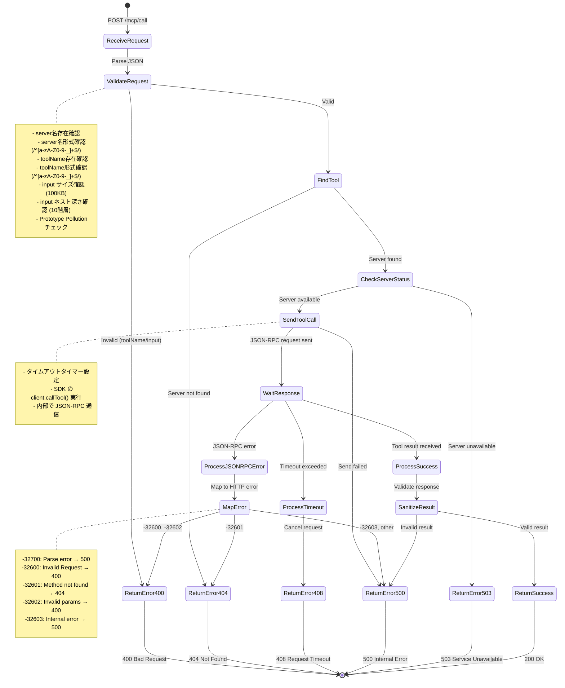
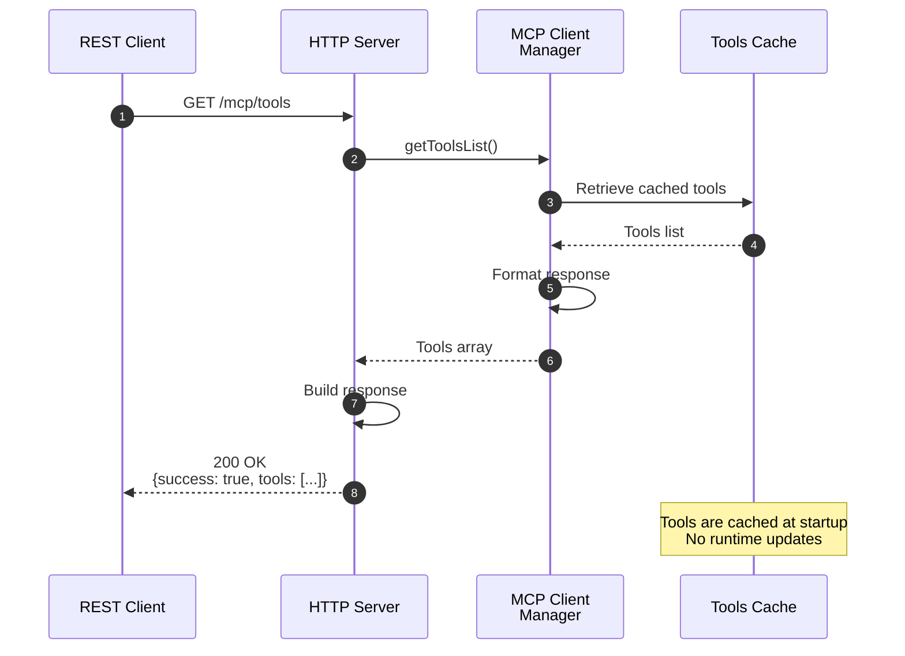
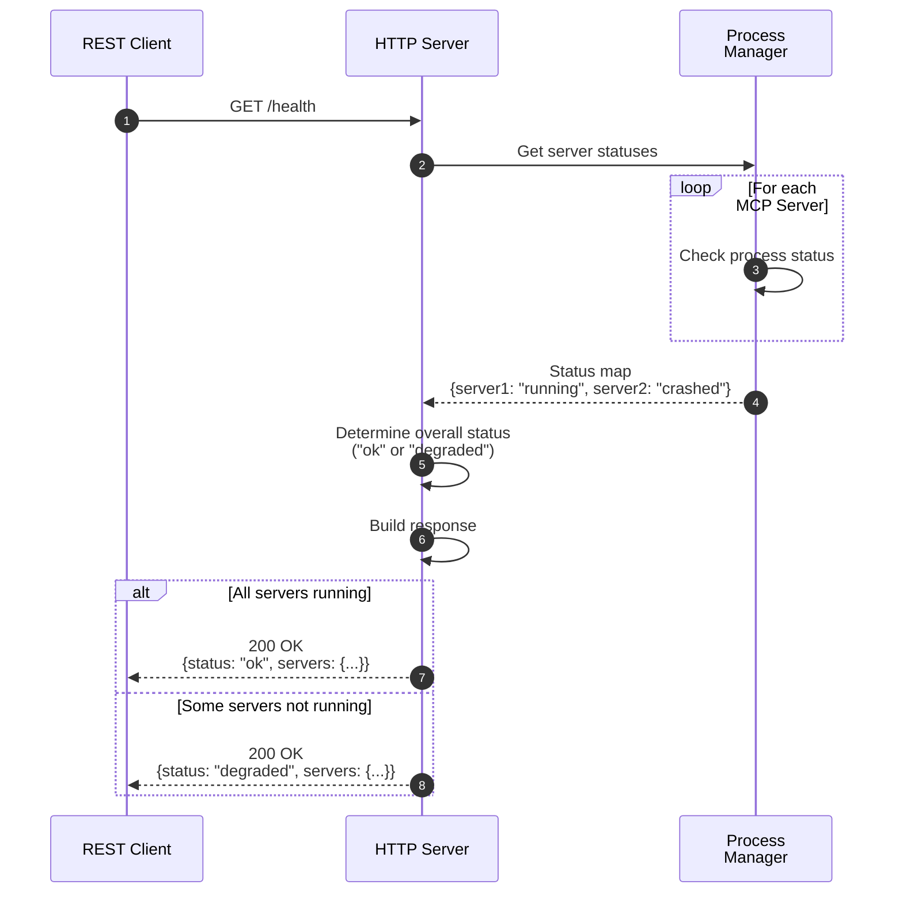
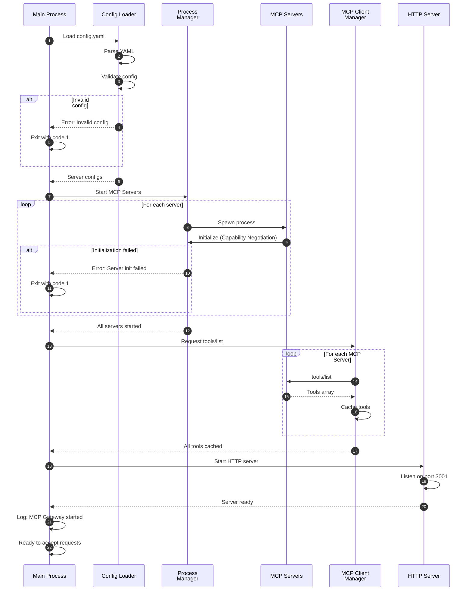
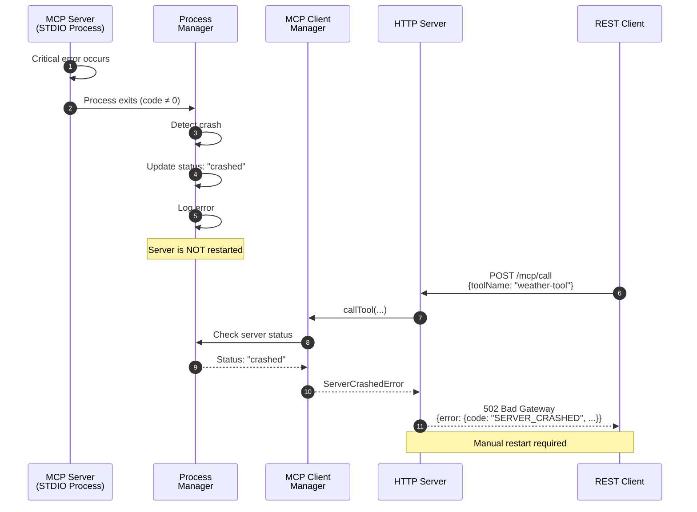
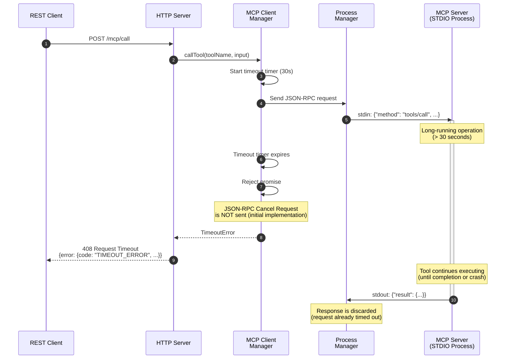
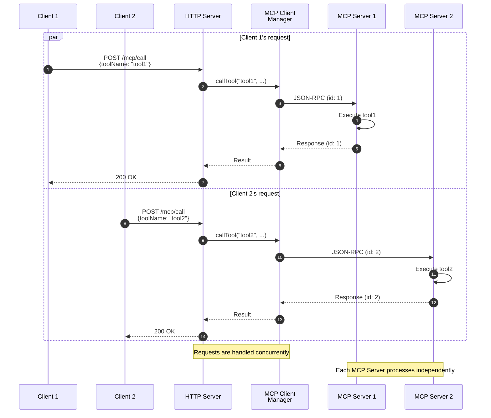

# 実行フローシーケンス

## 正常系シーケンス



---

## エラーハンドリングフロー



---

## Tools List 取得フロー



---

## Health Check フロー



---

## MCP Gateway 起動フロー



---

## MCP Server クラッシュフロー



---

## タイムアウトフロー



---

## 並行リクエスト処理フロー



---

## 詳細フェーズ説明

### Phase 1: リクエスト検証

**目的**: 不正なリクエストを早期に検出し、セキュリティリスクを軽減

**検証項目**:

1. **Content-Type チェック**: `application/json` であることを確認
2. **JSON パース**: リクエストボディを JSON としてパース
3. **toolName 検証**:
   - 存在確認
   - 正規表現チェック (`/^[a-zA-Z0-9-_]+$/`)
   - 最大長チェック（100文字）
4. **input 検証**:
   - オブジェクト型チェック
   - サイズチェック（100KB）
   - ネスト深さチェック（10階層）
   - Prototype Pollution チェック

**失敗時の動作**: `VALIDATION_ERROR` (400) を返却

---

### Phase 2: MCP Server 確認

**目的**: Tool が実行可能な状態であることを確認

**確認項目**:

1. **Tool 検索**: キャッシュから toolName を検索
2. **Server 状態確認**:
   - `running`: 正常動作中
   - `stopped`: 停止中
   - `crashed`: クラッシュ済み

**失敗時の動作**:

- Tool 未検出 → `TOOL_NOT_FOUND` (404)
- Server 停止中 → `SERVER_NOT_RUNNING` (503)
- Server クラッシュ → `SERVER_CRASHED` (502)

---

### Phase 3: Tools Call (JSON-RPC)

**目的**: MCP Server に Tool 実行を依頼

**処理内容**:

1. **タイムアウトタイマー設定**: config.yaml の timeout 値
2. **JSON-RPC リクエスト生成**:
   ```json
   {
     "jsonrpc": "2.0",
     "id": <unique-id>,
     "method": "tools/call",
     "params": {
       "name": <toolName>,
       "arguments": <input>
     }
   }
   ```
3. **stdin に書き込み**: `message + "\n"` を送信
4. **stdout から読み取り**: レスポンスを1行ずつ読み取り
5. **タイムアウト処理**: 時間内にレスポンスがなければエラー

**失敗時の動作**:

- タイムアウト → `TIMEOUT_ERROR` (408)
- JSON-RPC エラー → エラーコードに応じて 400/404/500

**注意**
実際の JSON-RPC の処理は、SDKが隠蔽していることに注意。

---

### Phase 4: レスポンスパース

**目的**: MCP Server からのレスポンスを検証し、HTTP レスポンスに変換

**処理内容**:

1. **タイムアウトタイマーキャンセル**: 成功時のみ
2. **JSON-RPC レスポンス検証**:
   - `jsonrpc: "2.0"` の確認
   - `id` の一致確認
   - `result` または `error` の存在確認
3. **result のサニタイズ**:
   - サイズチェック（1MB）
   - 型チェック
4. **HTTP レスポンス生成**:
   ```json
   {
     "success": true,
     "result": <sanitized-result>
   }
   ```

---

### Phase 5: 結果返却

**目的**: クライアントに結果を返却

**処理内容**:

1. **HTTPステータスコード設定**: 200 OK
2. **Content-Type 設定**: `application/json`
3. **レスポンスボディ送信**: JSON 文字列

---

## パフォーマンス考慮

### ボトルネック分析

| フェーズ | ボトルネック        | 対策                      |
| -------- | ------------------- | ------------------------- |
| Phase 1  | JSON パース         | 非同期処理、サイズ制限    |
| Phase 2  | キャッシュ検索      | Map による O(1) 検索      |
| Phase 3  | stdin/stdout 通信   | OS のパイプバッファ最適化 |
| Phase 4  | JSON シリアライズ   | サイズ制限、非同期処理    |
| Phase 5  | HTTP レスポンス送信 | ストリーミング            |

### 並行処理

- 各リクエストは独立して処理される
- MCP Server ごとに並行して Tool Call が実行可能
- 同一 Server への複数リクエストは JSON-RPC の `id` で区別

---

## 関連ドキュメント

- [API.md](API.md) - エンドポイント仕様
- [SystemArchitecture.md](SystemArchitecture.md) - コンポーネント構成
- [Security.md](Security.md) - バリデーションとセキュリティ
- [MCPProtocol.md](MCPProtocol.md) - JSON-RPC 通信詳細
- [Configuration.md](Configuration.md) - タイムアウト設定
