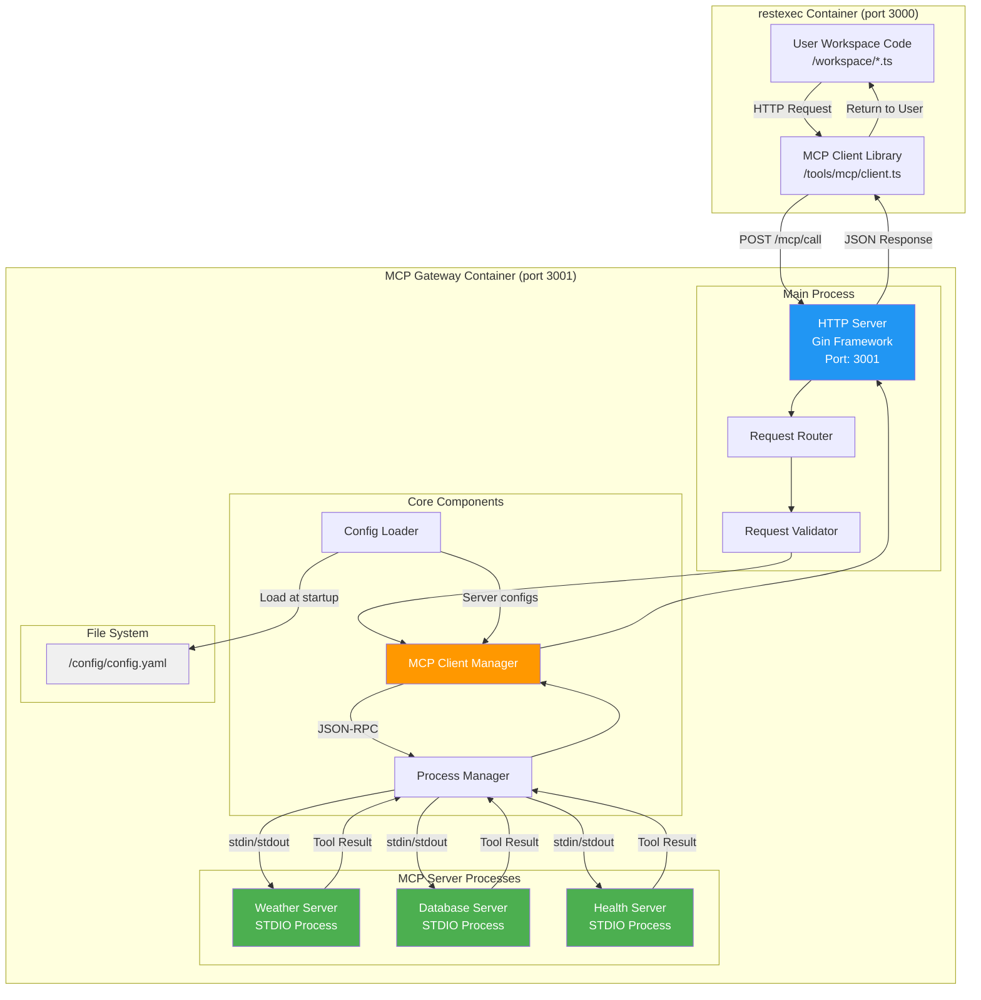

# システムアーキテクチャ



---

## コンポーネント説明

### HTTP Server (Gin Web Framework)

**役割**: HTTP リクエストの受信とレスポンスの返却

**責務**:

- Port 3001 でリクエストを受信
- ルーティング (`/mcp/call`, `/mcp/tools`, `/health`)
- レスポンスの生成（JSON形式）
- エラーハンドリングとHTTPステータスコードの設定
- ミドルウェアの適用（ロギング、リカバリーなど）

**技術スタック**:

- Go 1.21+
- Gin Web Framework v1.10+

### Request Router

**役割**: リクエストを適切なハンドラーに振り分け

**責務**:

- エンドポイントごとのルーティング
- ミドルウェアの適用
- リクエストコンテキストの管理

**Gin を使った実装例**:

```go
import (
	"github.com/gin-gonic/gin"
)

func setupRouter(
	clientManager *MCPClientManager,
	processManager *ProcessManager,
) *gin.Engine {
	// Ginインスタンスの作成
	router := gin.New()

	// ミドルウェアの適用
	router.Use(gin.Logger())    // ロギング
	router.Use(gin.Recovery())  // パニックからのリカバリー

	// ルーティング設定
	router.GET("/health", healthHandler(processManager))
	router.GET("/mcp/tools", getToolsHandler(clientManager))
	router.POST("/mcp/call", callToolHandler(clientManager, processManager))

	return router
}

// サーバーの起動
func startServer(router *gin.Engine, port string) error {
	return router.Run(":" + port)  // デフォルト: :3001
}
```

### Request Validator

**役割**: リクエストパラメータのバリデーション

**責務**:

- `toolName` の形式チェック
- `input` のサイズとネスト深さチェック
- Prototype Pollution 対策
- バリデーションエラーの生成

**バリデーション無効化**:

- 環境変数 `DISABLE_VALIDATION=true` で無効化可能
- テスト環境のみ推奨

詳細は [Security.md](Security.md) を参照。

### MCP Client Manager

**役割**: 複数の MCP Client の管理と Tool 呼び出しの調整

**責務**:

- 複数の MCP Client インスタンスを管理
- 各 MCP Client は1つの MCP Server に接続
- MCP Go SDK の Client を利用
- Tools List のキャッシュ
- Tools Call の実行
- エラーマッピング（JSON-RPC エラー → HTTP エラー）
- タイムアウト管理

**構造**:

```go
type MCPClientManager struct {
	clients map[string]*mcp.Client // server name → Client instance
	mu      sync.RWMutex
}

func (m *MCPClientManager) Initialize(configs []ServerConfig) error {
	m.mu.Lock()
	defer m.mu.Unlock()

	for _, config := range configs {
		transport := mcp.NewStdioTransport(mcp.StdioTransportConfig{
			Command: config.Command,
			Args:    config.Args,
		})

		client := mcp.NewClient(mcp.ClientConfig{
			Name:    "mcp-gateway",
			Version: "1.0.0",
		})

		if err := client.Connect(context.Background(), transport); err != nil {
			return err
		}

		m.clients[config.Name] = client
	}

	return nil
}

func (m *MCPClientManager) CallTool(ctx context.Context, server, toolName string, input any) (any, error) {
	m.mu.RLock()
	client, ok := m.clients[server]
	m.mu.RUnlock()

	if !ok {
		return nil, ErrServerNotFound
	}

	return client.CallTool(ctx, mcp.CallToolRequest{
		Name:      toolName,
		Arguments: input,
	})
}
```

**キャッシュ戦略**:

- 起動時に全 MCP Client から `client.listTools()` を取得
- メモリ上にキャッシュ
- `GET /mcp/tools` でキャッシュを返却

### Process Manager

**役割**: MCP Client と MCP Server プロセスの状態監視

**責務**:

- MCP Client の接続状態監視
- プロセスステータスの管理（available, unavailable）
- クラッシュ検知とステータス更新
- ヘルスチェック情報の提供

**注意**:

- プロセスの起動・停止は MCP Go SDK の Client/Transport が担当
- Process Manager は状態監視のみを行う

**ステータス管理**:

```go
type ServerStatus string

const (
	StatusAvailable   ServerStatus = "available"
	StatusUnavailable ServerStatus = "unavailable"
)

type ProcessManager struct {
	statuses map[string]ServerStatus
	mu       sync.RWMutex
}

func (p *ProcessManager) GetStatus(serverName string) ServerStatus {
	p.mu.RLock()
	defer p.mu.RUnlock()

	status, ok := p.statuses[serverName]
	if !ok {
		return StatusUnavailable
	}
	return status
}

func (p *ProcessManager) SetStatus(serverName string, status ServerStatus) {
	p.mu.Lock()
	defer p.mu.Unlock()
	p.statuses[serverName] = status
}

func (p *ProcessManager) GetAllStatuses() map[string]ServerStatus {
	p.mu.RLock()
	defer p.mu.RUnlock()

	statuses := make(map[string]ServerStatus, len(p.statuses))
	for k, v := range p.statuses {
		statuses[k] = v
	}
	return statuses
}
```

詳細は [MCPProtocol.md](MCPProtocol.md) を参照。

### Config Loader

**役割**: config.yaml の読み込みとパース

**責務**:

- 起動時に config.yaml を読み込み
- YAML のパースとバリデーション
- MCP Server 設定の提供
- 環境変数の展開

**設定ファイル**:

- パス: `/config/config.yaml`（環境変数 `CONFIG_PATH` で変更可能）
- ビルド時に固定（ランタイム変更不可）

詳細は [Configuration.md](Configuration.md) を参照。

---

## データフロー

### 1. Tool 呼び出しフロー

```
User Code → MCP Client → HTTP Server → Router → Validator
  → MCP Client Manager → Process Manager → MCP Server
  → Process Manager → MCP Client Manager → HTTP Server
  → MCP Client → User Code
```

**各段階の処理**:

1. **User Code**: `callMCPTool()` 関数を呼び出し
2. **MCP Client**: HTTP POST リクエストを送信
3. **HTTP Server**: リクエストを受信
4. **Router**: `/mcp/call` ハンドラーに振り分け
5. **Validator**: `toolName`, `input` をバリデーション
6. **MCP Client Manager**: 該当する MCP Server を検索、JSON-RPC リクエストを生成
7. **Process Manager**: stdin に JSON-RPC リクエストを書き込み
8. **MCP Server**: Tool を実行、stdout に JSON-RPC レスポンスを書き込み
9. **Process Manager**: stdout からレスポンスを読み取り
10. **MCP Client Manager**: レスポンスをパース、HTTP レスポンスに変換
11. **HTTP Server**: JSON レスポンスを返却
12. **MCP Client**: レスポンスを受信
13. **User Code**: 結果を取得

### 2. Tools List 取得フロー

```
HTTP Server → MCP Client Manager (キャッシュから返却) → HTTP Server
```

**キャッシュの更新**:

- 起動時に全 MCP Server から `tools/list` を取得
- ランタイム中は更新されない
- 変更が必要な場合はコンテナを再起動

### 3. Health Check フロー

```
HTTP Server → Process Manager (プロセスステータスを確認) → HTTP Server
```

**ステータス確認**:

- 各 MCP Server プロセスの状態を確認
- `running`, `stopped`, `crashed` のいずれかを返却

---

## プロセス分離モデル

### MCP Server プロセスの独立性

各 MCP Server は完全に独立した子プロセスとして動作します：

**独立要素**:

- **プロセス空間**: 各 Server は別プロセス
- **環境変数**: config.yaml で指定された環境変数のみを継承
- **stdin/stdout**: 各プロセスは独自の stdin/stdout を持つ
- **障害の分離**: 一つの Server がクラッシュしても他の Server に影響しない

**共有されない要素**:

- メモリ空間
- ファイルディスクリプタ
- プロセス内変数

### 環境変数の分離

MCP Gateway は各 MCP Server に最小限の環境変数のみを渡します：

**システム環境変数**（自動的に継承）:

- `PATH`


**ユーザー定義環境変数**（config.yaml で指定）:

- 各 Server ごとに個別に設定可能
- バリデーション制約あり（[Configuration.md](Configuration.md) 参照）

---

## セキュリティアーキテクチャ

### レイヤー別セキュリティ

```
┌─────────────────────────────────────────────┐
│ Layer 1: HTTP Server                       │
│ - リクエストサイズ制限                        │
│ - Content-Type チェック                      │
└─────────────────────────────────────────────┘
                  ↓
┌─────────────────────────────────────────────┐
│ Layer 2: Request Validator                  │
│ - toolName バリデーション                      │
│ - input サニタイズ                            │
│ - Prototype Pollution 対策                   │
└─────────────────────────────────────────────┘
                  ↓
┌─────────────────────────────────────────────┐
│ Layer 3: MCP Client Manager                 │
│ - タイムアウト管理                             │
│ - 出力サニタイズ                               │
│ - エラーメッセージの抽象化                       │
└─────────────────────────────────────────────┘
                  ↓
┌─────────────────────────────────────────────┐
│ Layer 4: Process Manager                    │
│ - プロセス分離                                │
│ - リソース制限                                │
│ - クラッシュ検知                              │
└─────────────────────────────────────────────┘
```

詳細は [Security.md](Security.md) を参照。

---

## スケーラビリティ考慮

### 垂直スケーリング

**MCP Server プロセスの増加**:

- config.yaml に新しい Server を追加
- コンテナを再ビルド・再起動
- 自動的に Tools List に追加される

**制限事項**:

- プロセス数の上限は OS の制限に依存
- 各プロセスのメモリ使用量に注意

### 水平スケーリング

**複数の MCP Gateway インスタンス**:

- ロードバランサーの背後に複数のコンテナを配置
- 各インスタンスは独立して動作（ステートレス）
- セッション管理は不要

**注意点**:

- 各インスタンスが同じ config.yaml を持つ必要がある
- MCP Server プロセスはインスタンスごとに起動される

---

## パフォーマンス考慮

### ボトルネックとなる可能性のある箇所

1. **stdin/stdout 通信**: JSON-RPC のシリアライズ/デシリアライズ
2. **プロセス間通信**: OS のパイプバッファサイズに依存
3. **Tools List キャッシュ**: 大量の Tool がある場合のメモリ使用量

### 最適化戦略

- **非同期処理**: すべての I/O 操作は非同期
- **キャッシュ**: Tools List は起動時にキャッシュ
- **タイムアウト**: 長時間実行される Tool のタイムアウト設定

---

## 障害復旧モデル

### MCP Server クラッシュ時

```
MCP Server クラッシュ
    ↓
Process Manager がクラッシュを検知
    ↓
プロセスステータスを "crashed" に更新
    ↓
次の Tool 呼び出し時に SERVER_CRASHED エラーを返却
    ↓
手動でコンテナを再起動
```

**自動再起動しない理由**:

- 無限再起動ループの防止
- クラッシュの原因調査を優先
- Server のバグの可能性が高い

### MCP Gateway 自体のクラッシュ

- コンテナオーケストレーション（Docker Compose, Kubernetes）による自動再起動
- ヘルスチェックエンドポイント (`/health`) による監視

---

## 関連ドキュメント

- [API.md](API.md) - HTTP エンドポイント仕様
- [Security.md](Security.md) - セキュリティモデルとバリデーション詳細
- [MCPProtocol.md](MCPProtocol.md) - MCP Protocol 実装詳細
- [Configuration.md](Configuration.md) - 環境変数と config.yaml 仕様
- [Sequence.md](Sequence.md) - リクエスト処理フロー
