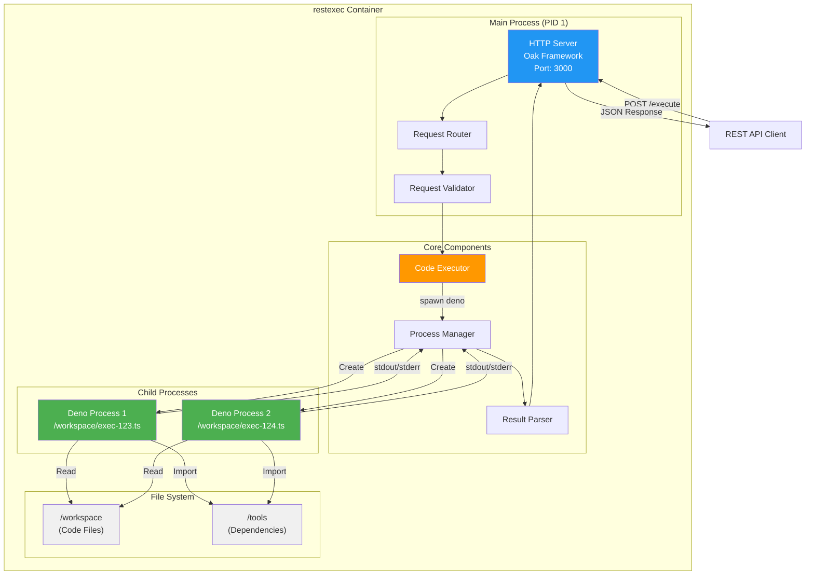

# restexec

`restexec` は、REST API経由でTypeScriptコードを安全に実行するサービスです。共有ディレクトリに配置されたTypeScriptファイルをDeno runtimeで動的に実行し、その結果をJSON形式で返却します。Denoの厳格なパーミッションシステムにより、ファイルシステム、ネットワーク、プロセス実行を細かく制御できます。

## システムアーキテクチャ



## ディレクトリ構造

```
services/restexec/              # サービスルート
├── src/                        # ソースコード
│   ├── app.ts                  # Oak アプリケーション設定
│   ├── index.ts                # エントリーポイント
│   ├── config.ts               # 設定管理
│   ├── executor.ts             # コード実行エンジン
│   ├── middleware/
│   │   └── validation.ts       # リクエストバリデーション
│   ├── routes/
│   │   ├── execute.ts          # 実行エンドポイント
│   │   └── health.ts           # ヘルスチェックエンドポイント
│   ├── types/
│   │   └── index.ts            # 型定義
│   └── utils/
│       ├── logger.ts           # ロガー
│       └── errors.ts           # カスタムエラークラス
├── tests/                      # テストスイート
│   ├── unit/
│   │   └── executor.test.ts    # Executor ユニットテスト
│   └── fixtures/
│       ├── success.ts          # テスト用の成功コード
│       ├── error.ts            # テスト用のエラーコード
│       └── timeout.ts          # テスト用のタイムアウトコード
├── example/                    # サンプルコードとユーティリティ
│   ├── workspace/              # 実行可能スクリプト
│   │   ├── hello-world.ts
│   │   ├── with-import.ts
│   │   └── async-example.ts
│   └── tools/                  # 共有ユーティリティライブラリ
│       ├── math.ts
│       └── string.ts
├── specs/                      # 仕様書
│   ├── API.md
│   ├── SystemArchitecture.md
│   ├── Security.md
│   ├── Libraries.md            # ライブラリ追加ガイド
│   └── ...
├── deps.ts                     # 外部ライブラリ依存関係
├── Dockerfile                  # Docker イメージ定義
├── deno.json                   # Deno 設定
├── DOCKER.md                   # Docker ドキュメント
└── README.md                   # このファイル
```

## 外部ライブラリの使用

restexecは`--cached-only`フラグを使用してセキュリティを強化しています。これにより、実行時に外部モジュールをダウンロードすることはできません。

外部ライブラリを使用する場合は、**ビルド時に事前にキャッシュする**必要があります。詳細な手順については、[ライブラリの追加方法](specs/Libraries.md)を参照してください。

### クイックスタート

1. `deps.ts`にライブラリを追加
2. `import_map.json`を更新（オプション）
3. コンテナを再ビルド: `docker compose build`
4. コンテナを起動: `docker compose up -d`

詳細は [specs/Libraries.md](specs/Libraries.md) を参照してください。
