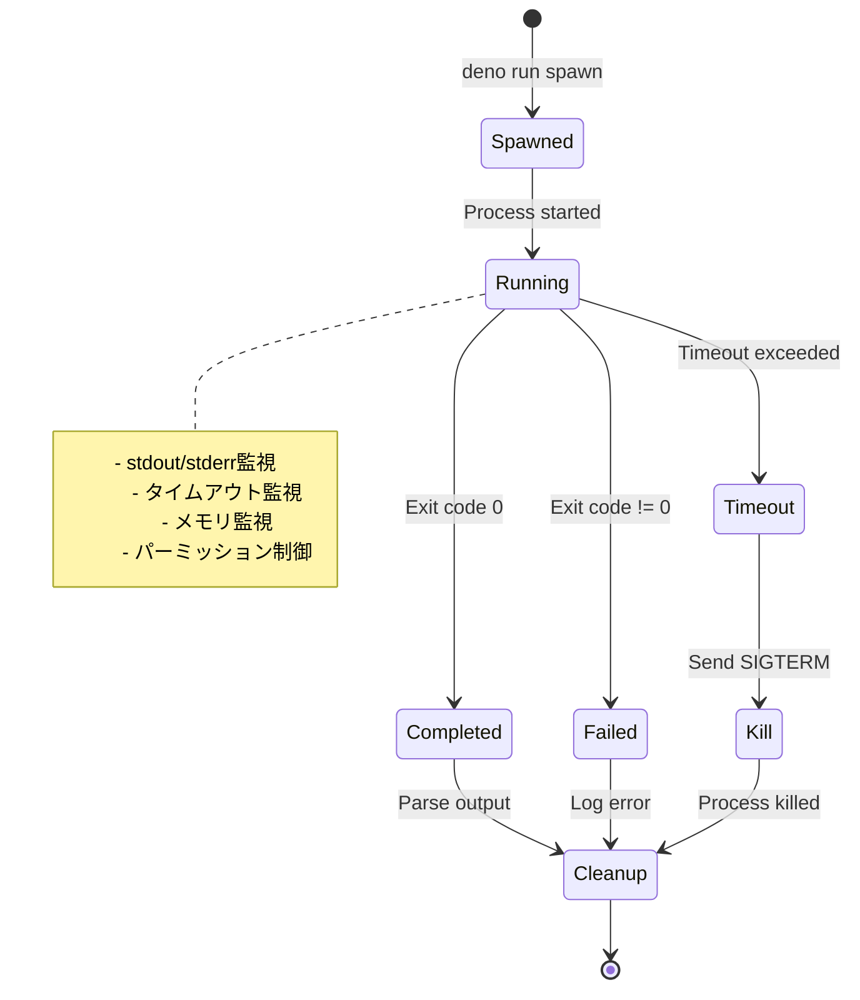

# 実行コードの規約

## コード実行方法

コードは Deno によって直接実行されます。特定の関数エクスポート形式は必要ありません。

- コードファイルは TypeScript (`.ts`) 形式
- `console.log()` による標準出力をキャプチャ
- Top-level await が使用可能
- `main()` 関数パターンまたは直接実行のどちらも可

## 必須規約

1. **JSON出力**: 実行結果は必ずJSON形式で標準出力に出力する (`console.log(JSON.stringify(...))`)
2. **エラーハンドリング**: エラー時は適切なエラーオブジェクトを出力する
3. **非同期処理**: Promiseが完了するまで終了しない

## 推奨規約

1. **構造化出力**: 一貫した構造でJSONを出力する
2. **タイムスタンプ**: 結果にタイムスタンプを含める
3. **エラー詳細**: エラー時は詳細情報を含める

## 標準出力フォーマット

**成功時**:
```json
{
  "success": true,
  "result": { ... },
  "timestamp": "2025-01-09T12:00:00.000Z"
}
```

**エラー時**:
```json
{
  "success": false,
  "error": "Error message",
  "timestamp": "2025-01-09T12:00:00.000Z"
}
```

# プロセス管理

## プロセスライフサイクル



## リソース管理

| リソース | 制限値 | 説明 |
|---------|--------|------|
| **タイムアウト** | 5秒 (デフォルト) | 最大300秒まで設定可能 |
| **メモリ** | 制限なし | コンテナレベルで制限 |
| **CPU** | 制限なし | コンテナレベルで制限 |
| **同時実行** | 制限なし | HTTP Server が管理 |

## クリーンアップ

1. **正常終了時**: プロセスの自動クリーンアップ
2. **タイムアウト時**: `SIGTERM` → 1秒待機 → `SIGKILL`
3. **サーバーシャットダウン時**: すべての子プロセスに `SIGTERM`
