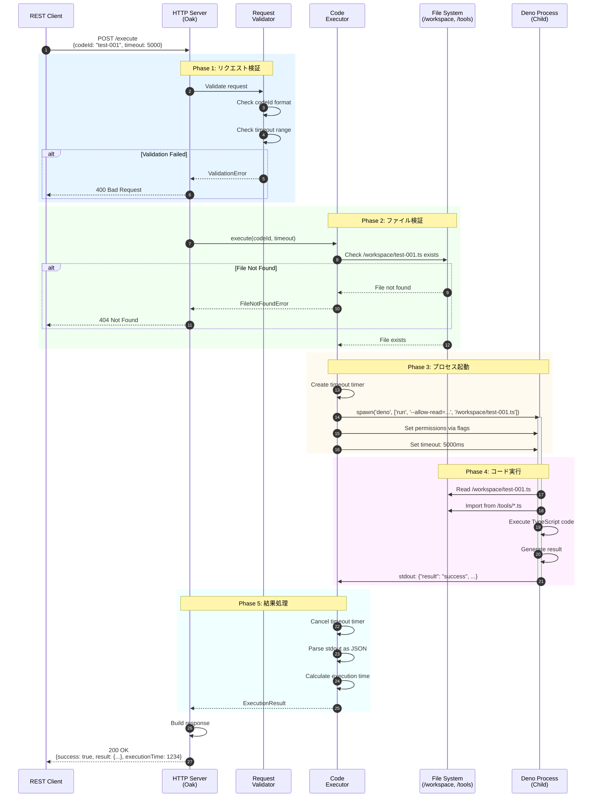
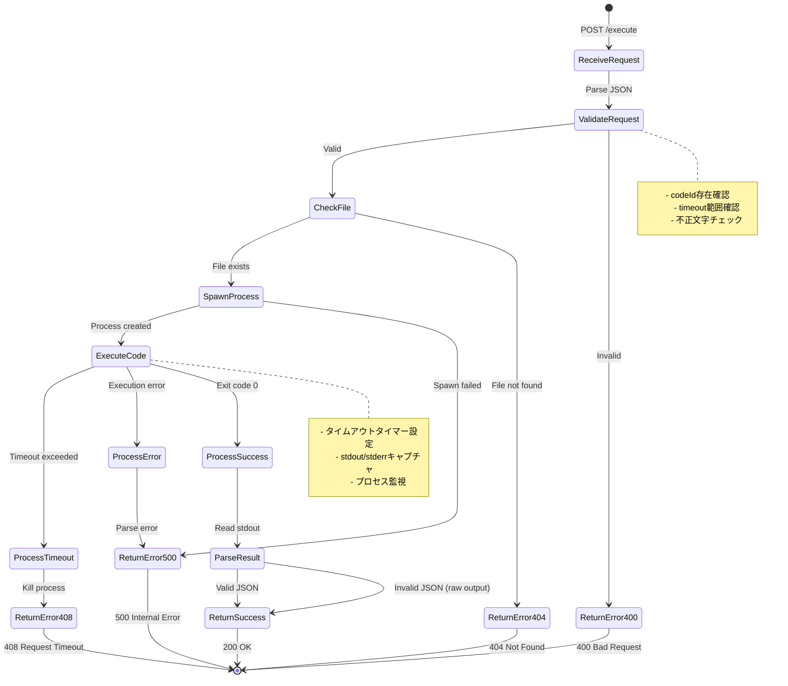

# 実行フローシーケンス

```mermaid
sequenceDiagram
    autonumber
    participant Client as REST Client
    participant HTTP as HTTP Server<br/>(Oak)
    participant Validator as Request<br/>Validator
    participant Executor as Code<br/>Executor
    participant FS as File System<br/>(/workspace, /tools)
    participant Process as Deno Process<br/>(Child)
    
    Client->>HTTP: POST /execute<br/>{codeId: "test-001", timeout: 5000}
    
    rect rgb(230, 245, 255)
        Note over HTTP,Validator: Phase 1: リクエスト検証
        HTTP->>Validator: Validate request
        Validator->>Validator: Check codeId format
        Validator->>Validator: Check timeout range
        alt Validation Failed
            Validator-->>HTTP: ValidationError
            HTTP-->>Client: 400 Bad Request
        end
    end
    
    rect rgb(240, 255, 240)
        Note over Executor,FS: Phase 2: ファイル検証
        HTTP->>Executor: execute(codeId, timeout)
        Executor->>FS: Check /workspace/test-001.ts exists
        alt File Not Found
            FS-->>Executor: File not found
            Executor-->>HTTP: FileNotFoundError
            HTTP-->>Client: 404 Not Found
        end
        FS-->>Executor: File exists
    end
    
    rect rgb(255, 250, 240)
        Note over Executor,Process: Phase 3: プロセス起動
        Executor->>Executor: Create timeout timer
        Executor->>Process: spawn('deno', ['run', '--allow-read=...', '/workspace/test-001.ts'])
        activate Process
        Executor->>Process: Set permissions via flags
        Executor->>Process: Set timeout: 5000ms
    end
    
    rect rgb(255, 240, 255)
        Note over Process,FS: Phase 4: コード実行
        Process->>FS: Read /workspace/test-001.ts
        Process->>FS: Import from /tools/*.ts
        Process->>Process: Execute TypeScript code
        Process->>Process: Generate result
        Process->>Executor: stdout: {"result": "success", ...}
        deactivate Process
    end
    
    rect rgb(240, 255, 255)
        Note over Executor,HTTP: Phase 5: 結果処理
        Executor->>Executor: Cancel timeout timer
        Executor->>Executor: Parse stdout as JSON
        Executor->>Executor: Calculate execution time
        Executor-->>HTTP: ExecutionResult
    end
    
    HTTP->>HTTP: Build response
    HTTP-->>Client: 200 OK<br/>{success: true, result: {...}, executionTime: 1234}
```

# エラーハンドリングフロー

```mermaid
stateDiagram-v2
    [*] --> ReceiveRequest: POST /execute
    
    ReceiveRequest --> ValidateRequest: Parse JSON
    
    ValidateRequest --> CheckFile: Valid
    ValidateRequest --> ReturnError400: Invalid
    
    CheckFile --> SpawnProcess: File exists
    CheckFile --> ReturnError404: File not found
    
    SpawnProcess --> ExecuteCode: Process created
    SpawnProcess --> ReturnError500: Spawn failed
    
    ExecuteCode --> ProcessTimeout: Timeout exceeded
    ExecuteCode --> ProcessError: Execution error
    ExecuteCode --> ProcessSuccess: Exit code 0
    
    ProcessTimeout --> ReturnError408: Kill process
    ProcessError --> ReturnError500: Parse error
    ProcessSuccess --> ParseResult: Read stdout
    
    ParseResult --> ReturnSuccess: Valid JSON
    ParseResult --> ReturnSuccess: Invalid JSON (raw output)
    
    ReturnError400 --> [*]: 400 Bad Request
    ReturnError404 --> [*]: 404 Not Found
    ReturnError408 --> [*]: 408 Request Timeout
    ReturnError500 --> [*]: 500 Internal Error
    ReturnSuccess --> [*]: 200 OK
    
    note right of ValidateRequest
        - codeId存在確認
        - timeout範囲確認
        - 不正文字チェック
    end note
    
    note right of ExecuteCode
        - タイムアウトタイマー設定
        - stdout/stderrキャプチャ
        - プロセス監視
    end note
```
