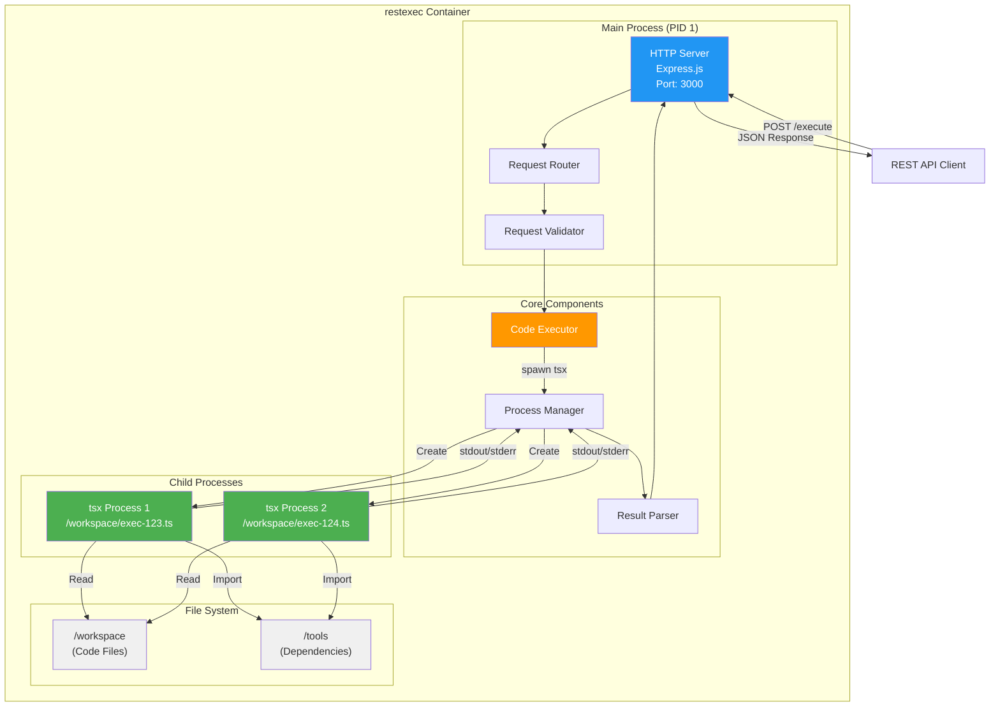

# システムアーキテクチャ

```mermaid
graph TB
    subgraph "restexec Container"
        subgraph "Main Process (PID 1)"
            HTTPServer["HTTP Server<br/>Express.js<br/>Port: 3000"]
            Router["Request Router"]
            Validator["Request Validator"]
        end
        
        subgraph "Core Components"
            Executor["Code Executor"]
            ProcessMgr["Process Manager"]
            ResultParser["Result Parser"]
        end
        
        subgraph "Child Processes"
            TSX1["tsx Process 1<br/>/workspace/exec-123.ts"]
            TSX2["tsx Process 2<br/>/workspace/exec-124.ts"]
        end
        
        subgraph "File System"
            Workspace["/workspace<br/>(Code Files)"]
            Tools["/tools<br/>(Dependencies)"]
        end
    end
    
    Client["REST API Client"] -->|POST /execute| HTTPServer
    HTTPServer --> Router
    Router --> Validator
    Validator --> Executor
    
    Executor -->|spawn tsx| ProcessMgr
    ProcessMgr -->|Create| TSX1
    ProcessMgr -->|Create| TSX2
    
    TSX1 -->|Read| Workspace
    TSX1 -->|Import| Tools
    TSX2 -->|Read| Workspace
    TSX2 -->|Import| Tools
    
    TSX1 -->|stdout/stderr| ProcessMgr
    TSX2 -->|stdout/stderr| ProcessMgr
    ProcessMgr --> ResultParser
    ResultParser --> HTTPServer
    HTTPServer -->|JSON Response| Client
    
    style HTTPServer fill:#2196F3,color:#fff
    style Executor fill:#FF9800,color:#fff
    style TSX1 fill:#4CAF50,color:#fff
    style TSX2 fill:#4CAF50,color:#fff
    style Workspace fill:#f0f0f0
    style Tools fill:#f0f0f0
```